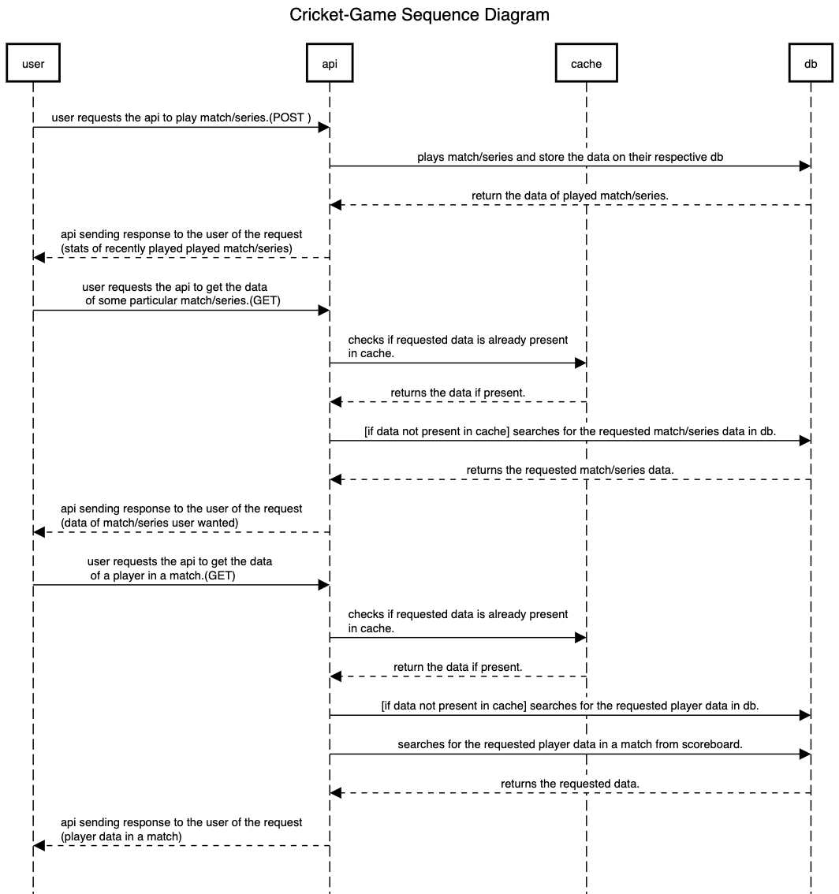

# Cricket-Game

# J-easy Rule Engine Powered Cricket Game Application

**Pros of using j-easy rule engine**

    Rule systems are capable of solving very, very hard problems, providing an explanation of how the solution was arrived at and why each "decision" along the way was made.

    Have better speed and scalability than if-else etc.

    Rule systems effectively provide an "explanation facility" by being able to log the decisions made by the rule engine along with why the decisions were made.

    Instead of the logic being spread across many domain objects or controllers, it can all be organized in one or more very distinct rules files.

**Cons of using j-easy rule engine**

    Requires more coding than if-else etc.

    if conditions are less then becomes an overkill.

**Sequence Diagram describing our api calls.**

**Class Diagram**

**DB Diagram/Design**

**This swagger image shows the API Documentation of our application to perform multiple tasks.**

**Gatling Results:**

**for baseURL/matches/{matchId}/player-id/{playerId}**

**for baseURL/matches/{matchId}**

**Game Flow**

* First we’ll Initialize Teams and their players
* Then We’ll ask whether it’s a single match or series.
* Ask for no. of games will be played in the series.(if single match N =1)
* type of games will be played in series (T20/ODI). initialize total over accordingly
* Play N matches
    * Start Match -
        * Toss (Assign Bowling/ Batting)
        * Start first Inning(Batting, Bowling)
            * Call two batsmen from Batting team(Striker and Non-striker) and call for Bowler from Bowling Team.
            * start bowling(until all over ends/ all wickets fall down)
                * Generate result of ball from random func.
                * Update ball played by Striker/ bowled by bowler.
                * if run scored
                    * update score of team and individual players(Batsman and Bowler)
                    * if run is odd - Change strike.
                * if wicket
                    * update wicket of team/bowler
                    * Dismiss Striker
                    * call for next batsman (valid batsman) - Assign Striker
                * if last ball of over
                    * Change Strike
                    * call for next bowler (valid bowler)
        * Swap Teams ( Swap(Batting, Bowling))
        * Start second Inning - same first above
    * Increment the count of wins of winning Team
* After N matches which team has(Wins>n/2) will be the series winner.

valid Bowler

    Haven’t bowled last over and have bowled less than N/5 overs.

valid Batsman

    Next player in batting order.

